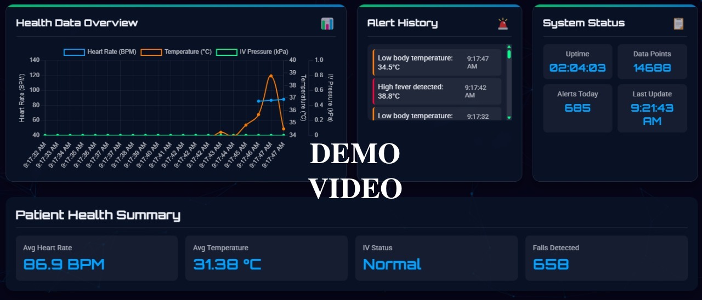

# 🏥 Nursing-Assistant-IoT

An **IoT-Based Nursing Assistant System** designed to support healthcare professionals by providing **real-time monitoring and alerts** for critical patient health parameters. The system integrates multiple sensors with **ESP32 microcontrollers**, offering a **wireless**, **scalable**, and **automated** solution for patient care in hospitals and home settings.

---

## 🚀 Key Features

✅ **Automated Fall Detection**  
✅ **Continuous Heart Rate Monitoring (BPM)**  
✅ **Body Temperature Monitoring**  
✅ **IV Drip Blockage Detection**  
✅ **Real-Time Alerts & Notifications**  
✅ **Centralized Health Dashboard**  
✅ **Scalable, Wireless & Low-Cost Solution**
✅ **Portable Solution**

---

## 🛠️ System Overview

Our system continuously monitors patients' **vital signs** and **critical events** using ESP32 microcontrollers and a suite of sensors. All data is transmitted wirelessly to a **central dashboard** which is displayed on the Raspberry Pi , enabling healthcare professionals to respond promptly to emergencies.

### 📡 Sensors & Functions
| **Sensor**                 | **Function**                      |
|----------------------------|-----------------------------------|
| **MPU6050**                | Fall Detection                   |
| **MAX30102**               | Heart Rate Monitoring (BPM)      |
| **MLX90614**               | Body Temperature Monitoring      |
| **MPX5010DP**              | IV Drip Blockage Detection       |

---

## 🤖 Hardware Configuration

| **IV Drip** | **Heart Rate** |
|:----------------:|:----------------:|
|  |  |

| **Fall Detection** | **Body Temperature** |
|:----------------:|:----------------:|
|  |  |

---

## 🌐 How It Works
1. **ESP32** collects real-time data from sensors.
2. Data is transmitted wirelessly via **Wi-Fi** or **Bluetooth**.
3. A **central dashboard** displays data and triggers alerts in case of abnormal readings.
4. Notifications are displayed on the dashboard .

### Hardware Video

*Temperature Sensor*
https://drive.google.com/file/d/1NdAGeLqjoPZvNUzMEhzjwG0RjwxM2KyB/view?usp=sharing

*IV Drip Bag*
https://drive.google.com/file/d/187anQKqgCJMwmhiz1YGUYUgredNpgKGB/view?usp=sharing

*Heart Rate Sensor*
https://drive.google.com/file/d/14fyySwTLVPXoYs3mIukuYB-nn6UY31tf/view?usp=sharing

*Fall Detection*
https://drive.google.com/file/d/1_Oszz0amC1riKDDpdqzab_BiWN34bAwV/view?usp=sharing

*Arduino Working*
https://drive.google.com/file/d/13bq23o-s72du2WpbSAxa6upHlGGRc_2-/view?usp=drive_link

---

## 🖥️ UI/UX Screenshots

### Health Overview

### Heart Rate Monitoring

### Body Temperature Monitoring

### IV Drip Monitoring

### Fall Detection Monitoring

---

## 📹 Demonstration Video

🎥 **Click the thumbnail to watch the full demo!**

---

## ⚙️ Tech Stack

- **Microcontroller**: ESP32  
- **Programming Language**: C++ (Arduino Framework)  
- **Dashboard**: Web-based (Html , CSS , Js)   
- **Communication**: Wi-Fi / WebSocket 
- **Sensors**: MPU6050, MAX30102, MLX90614, MPX5010DP  

## 👥 Contributors
- **Jobinjoy Ponnappal** - Project Lead  
- **Kavya Raj P** - Developer  
- **Joel M Jaison** - Developer  
- **Krishna Sagar P** - Developer  
- **Jonathan M Paduthala** - Front-End Developer  

---

## 💡 Future Improvements
- Integrate AI/ML for predictive health analytics  
- Mobile app for patient health notifications  
- Database integration to support a large number of patients  
- Extended sensor support for SpO2, ECG  
